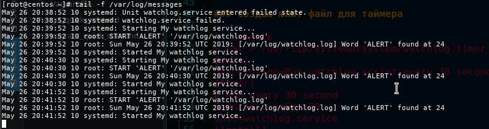

## Домашнее задание к уроку 7

```console
$ sudo su -
```

> Написать сервис, который будет раз в 30 секунд мониторить лог на предмет наличия ключевого слова. Файл и слово должны задаваться в /etc/sysconfig

### Создаю файл с переменными среды

```console
$ cat > /etc/sysconfig/watchlog << EOF
WORD="ALERT"
LOG=/var/log/watchlog.log
EOF
```

### Создаю скрипт, который будет запускаться

```console
$ cat > /opt/watchlog.sh << EOF
#!/bin/bash
WORD=\$1
LOG=\$2
DATE=\`date\`
for iPosition in \`grep -aob \$WORD \$LOG | grep -oE '[0-9]+'\`; do
    logger "\$DATE: [\$LOG] Word '\$WORD' found at \$iPosition"
done
EOF
```

### Создаю юнит файл для скрипта

```console
$ cat > /usr/lib/systemd/system/watchlog.service << EOF
[Unit]
Description=My watchlog service
[Service]
Type=oneshot
EnvironmentFile=/etc/sysconfig/watchlog
ExecStart=/opt/watchlog.sh \$WORD \$LOG
EOF
```

### Создаю юнит файл для таймера

```console
$ cat > /usr/lib/systemd/system/watchlog.timer << EOF
[Unit]
Description=Run watchlog script every 30 second
[Timer]
# Run every 30 second
OnUnitActiveSec=30
Unit=watchlog.service
[Install]
WantedBy=multi-user.target
EOF
```

### Добавляю права на выполнение скрипту

```console
$ chmod +x /opt/watchlog.sh
```

### Запускаю сервисы

```console
$ systemctl start watchlog.timer
```

### Добавляю запись в лог файл

```console
$ echo "ALERT" >> /var/log/watchlog.log
```

### Проверяю результат

```console
$ tail -f /var/log/watchlog.log
```


