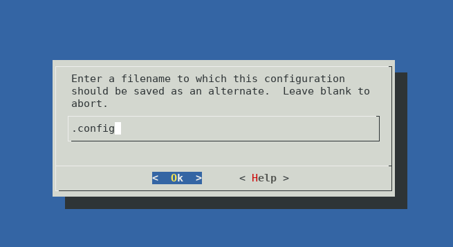

### Установка образа через vagrant
```bash
~/Projects/otus-linux$ env -u GEM_HOME -u GEM_PATH vagrant up
```


### Запуск образа
```bash
~/Projects/otus-linux$ env -u GEM_HOME -u GEM_PATH vagrant ssh otuslinux
```

### Скачивание образа с помощью curl с kernel.org. Качаю stable 5.0.9.

```bash
curl https://cdn.kernel.org/pub/linux/kernel/v5.x/linux-5.0.9.tar.xz -O
```


### Установка пакетов, необходимых для сборки ядра

```bash
sudo yum install ncurses-devel make gcc bc openssl-devel
sudo yum install elfutils-libelf-devel
sudo yum install rpm-build
```


### Распаковка архива с исходниками ядра

```bash
tar xvf linux-5.0.9.tar.xz
```

### Перехожу в папку linux-5.0.9. Копирую /boot/config-3.10.0-957.5.1.el7.x86_64

```bash
cd linux-5.0.9/
sudo cp -v /boot/config-3.10.0-957.5.1.el7.x86_64 .config
```


### Запускаю make menuconfig

```bash
make menuconfig
```


Получаю ошибку

```bash
/bin/sh: flex: command not found
make[2]: *** [scripts/kconfig/zconf.lex.c] Error 127
make[1]: *** [menuconfig] Error 2
make: *** [sub-make] Error 2
```

### Установка недостающих пакетов

```bash
sudo yum install flex
sudo yum install bison
```

### Запускаю make menuconfig


### Нажимаю Save



### Нажимаю OK


### Выхожу

### Запускаю процесс компиляции

```bash
make rpm-pkg -j3
```


