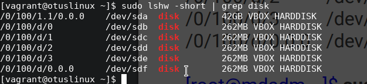
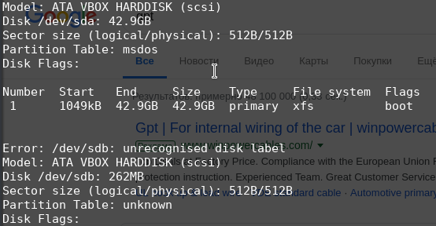
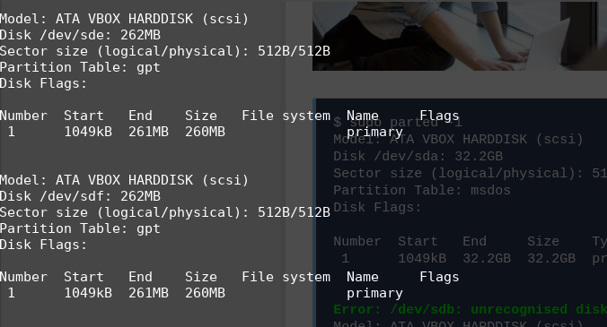
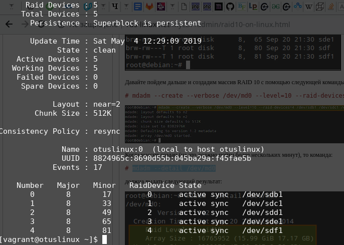
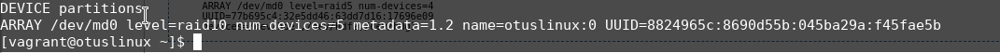

## Домашнее задание к уроку 2

### Добавить в Vagrantfile еще дисков

#### Открываю файл Vagrantfile

```bash
vim Vagrantfile
```

#### Добавляю строку

```
                :sata5 => {
                        :dfile => './sata5.vdi',
                        :size => 250, # Megabytes
                        :port => 5
                }
```

#### Сохраняю

###  Запускаю Vagrant

```bash
vagrant up
vargrant ssh
```

### Проверяю наличие диска

```bash
sudo lshw -short | grep disk
```



### Проверяю не смотированы ли диски

```bash
sudo mount | grep "/dev/sd[bcdef]"
# И отмонитрую, если таковые иеются: sudo umount 
```

### Проверяю таблицу разделов

```bash
sudo parted -l
```



### Зануляю суперблоки

```bash
sudo mdadm --zero-superblock --force /dev/sd{b,c,d,e,f}
```


### Создаем на дисках разделы

```bash
sudo parted -s -a optimal /dev/sdb mklabel gpt -- mkpart primary ext4 0% 100%
sudo parted -s -a optimal /dev/sdc mklabel gpt -- mkpart primary ext4 0% 100%
sudo parted -s -a optimal /dev/sdd mklabel gpt -- mkpart primary ext4 0% 100%
sudo parted -s -a optimal /dev/sde mklabel gpt -- mkpart primary ext4 0% 100%
sudo parted -s -a optimal /dev/sdf mklabel gpt -- mkpart primary ext4 0% 100%
```

### Проверяю

```bash
sudo parted -l
```



### Создаю RAID 10 из 5 партиций

```bash
sudo mdadm --create --verbose /dev/md0 -l 10 -n 5 /dev/sd{b,c,d,e,f}1
```

### Проверяю RAID

```bash
sudo mdadm --detail /dev/md0
```



### Создаю файловую систему ext4

```bash
sudo mkfs.ext4 /dev/md0
```

### Создаю точку монтирования и проверяю монтируется ли фс

```bash
sudo mkdir /raid
sudo mount /dev/md0 /raid/
# создаю тестовые файлы
sudo touch /raid/file{0..10}.txt
```

### Создаю конфигурационный файл mdadm.conf

```bash
sudo mkdir /etc/mdadm
sudo sh -c 'echo "DEVICE partitions" > /etc/mdadm/mdadm.conf'
sudo sh -c "mdadm --detail --scan --verbose | awk '/ARRAY/ {print}' >> /etc/mdadm/mdadm.conf"
```




